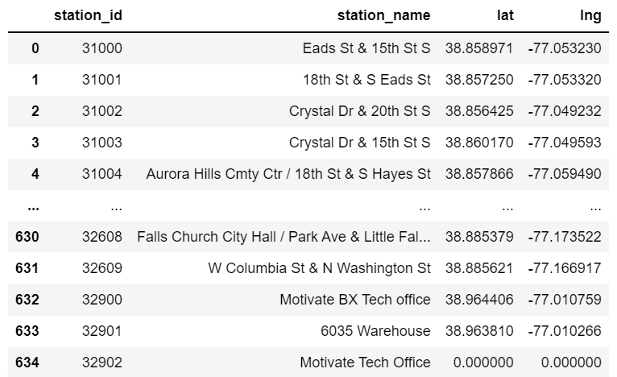
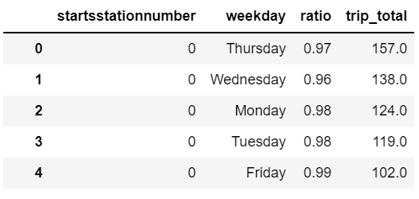
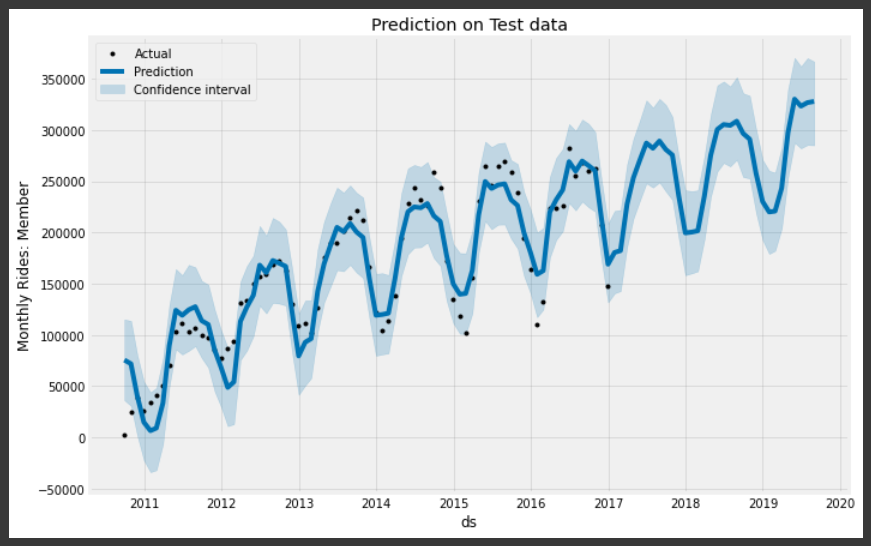
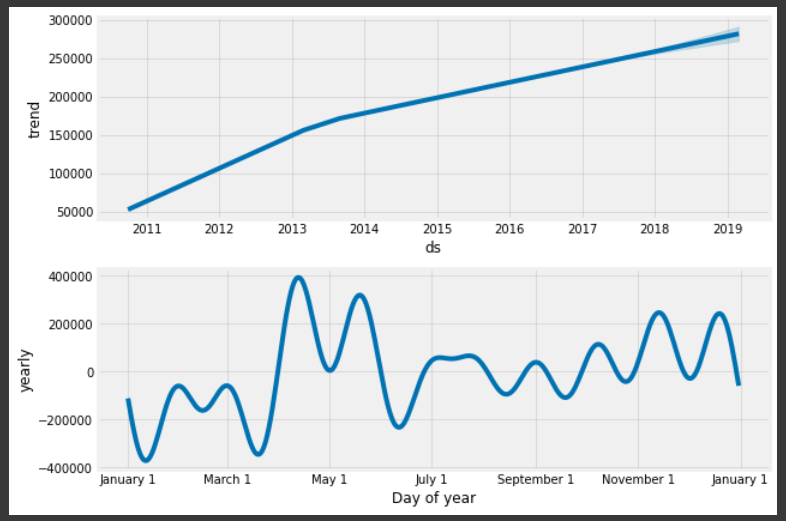

# Final Project

Team 5: Thomas Shane, Paola Escamilla, Takuma Koide, Habtamu Tikuye, Mair Manson, Derrick Amegashie

## Content
### Selected Topic
An analysis of Capital Bike Share service in Washington D.C.

### Reasons for Topic Selection
The bike sharing service has become increasingly popular in the main cities of the U.S. The possibility of mobilizing without schedule and traffic constraints appeals to the general public. This service also offers different payment tiers that adjust conveniently to the riders’ income. 

The innovation focus that the service brings to the way we understand and see transportation became of interest to the team members. By engaging in conversations between ourselves we came to creative ideas, possibilities and hypotheses that caught our complete attention. We discussed income, gender, age and security however, as our analysis developed we uncovered that the riders of the bike sharing service, and the service as such, follows a strictly predictive behavior.

All the hypotheses that we came to, such as: (1) Is the service, through its cost, excluding low income riders from usage? (2) Is there a gender bias in the service? (3) Are bike stations less likely to be opened in neighbourhoods considered risky/insecure? and (4) Are the owners of the service disregarding the growth opportunities behind the “age” feature?, slowly faded from our analysis by uncovering, through the data retrieved, that the riders strongly behave as one would expect them to behave.

With this said, our analysis question transformed to **“Are Capital Bike Share riders rational actors?”**

Knowing that a rational actor is an individual who uses rational calculations to make choices and achieve their own personal objectives, he or she will use rational calculations and choices, to satisfy their self-interest and receive the greatest benefit and satisfaction, given the limited option they have available.

With this introduction to the team’s thinking process, we present the steps to our analysis to sustain our hypotheses:

### Description of Source Data
Our work used secondary data already collected by the capital bike share service through their website: https://www.capitalbikeshare.com/system-data. 

The data was stored in CSV format files, from 2010 to 2021. 

For the years 2010 and 2011, the daily bike ride information was gathered in a unique CSV file. From 2012 to 2017, the daily bike ride information was gathered in quarterly arranged CSV files and, for the remaining years,  the bike ride information was collected in monthly arranged CSV files.

It must be highlighted that some months had to be disregarded from the analysis due to a lack of data (e.g. year 2020 skipped the month of april and year 2021 ended in may).

In total, our final dataset was created by taking a total of 66 CSV files with over 26,000,000 rows and 8 columns each.

### Analysis Question
As previously introduced, our analysis question is **“Are Capital Bike Share riders rational actors?”**.

To sustain, or refute, our hypothesis the analysis dived into:
- Total bike rides per year
- Distribution of ‘member type’ per station
- Time of the day and day of the week of the ride
- Location of Bike stations (lat, long)

### Description of Data Exploration Phase
The data exploration phase started with a review of the websites of the known bike share services in different cities in the United States. We were able to find available data for the cities of New York, Chicago, Pittsburgh, Boston and Washington D.C. 

Even though all cities showed consistent data we decided to stay with Washington D.C. considering this is the city where all team members live and therefore, we could understand better. 

The data retrieved in the capital bike share website was consistent and showed quality. Each CSV file had the same features/columns aside from 2020 and 2021 where we found a couple of new columns added. For the purposes of our analysis, we disregarded those new addings to maintain the same consistency of the information.

The size of the data collected for each year was considerably large. The amount increased our reliability to the data as we were able to draw some time series in our work. 

## DATABASE INTEGRATION

Before arriving to the ETL Process, and once our data was reviewed and understood, a database, and its relationships, were established to facilitate the transformation process of the data. 

After identifying and organizing the raw data extracted from the capital bike share website, we established five tables to integrate our database: 

These five tables were loaded into a PostgerSQL database. While working on the data analysis we also extracted different tables using SQL join query. In the image below an example is shown of a table created by "Inner join" from our *station_list* and *station_list_active*.

## ETL Process
Once with the information identified, our analysis started with an ETL process which aimed to create one big dataset from all the individual CSV files. 
 
The final dataset contained all 28M trips and was conformed by the following columns: 'Trip Number,' 'Starts station number,' 'End station number,' 'start date,' 'end date,' and 'member type'.

From this unified dataset, a series of tables were extracted. The processes is described below:

### Table 1: "all_bike_trips"
1. For the first table, we created an index of the 66 csv files to allow python to call the files by each individual directory and file name. 
2. Then, the files were processed. From index 0-52 and 53-65 separately as those files have different columns. The resulting CSV file can be refered to as: <Resources/capitalbikeshare_dataset_index.csv>.
3. The data points from index 0-52 had a unique column named 'Bike number', which showed which bike was used for each trip.
4. After cleaning the data and dropping unnecessary columns, the output was recorded as a dataframe under a CSV file called: `trips_2010to202003.csv`.
5. The data points from index 53-65 had a unique column named 'rideable_type,' which describes which bike type was used. We extracted this information separately to analyze how this variable affects the membership type of users.
6. After cleaning the data and dropping unnecessary columns, the output was recorded as a dataframe under a CSV file called: `trips_202005to202105.csv`.
7. Then, both resulting CSV filees were merged (the `trips_2010to202003.csv` and `trips_202005to202105.csv`).
8. Lastly, from the merged file, unnecessary columns were dropped, NaN rows cleaned up, mixed data type columns removed and datatype converted to give us our `Table1_all_bike_trips.csv`.

## Visual representation of the output:
Table #1 all_bikes_trips

 
### Table 4: station_list 
1. Noting that from April 2020 upto May 2021 is the time range in which Capital Bikeshare started to record geographic information, we created a dataset with the list of data for `station_id` which provides the latitude and longitude of each station.
2. We used the data from index 53 to 65 to create a new dataframe with 'stationnumber' and its corresponding geocode.
3. The output was a CSV file named: `Table4_station_list` which held columns: `stationnumber`, `lat`, and `lng` to refer to the location of each bike station.

## Visual representation of the output:
Table #4 Station List

### Table 6: number_of_trips
1.  From the `all_bike_trips.csv` file, we extracted an additional dataframe to display the number of trips taken in each staion number.
2.  We used the `value_counts()` method to list how many times each station appears over the 28M trips recorded in our dataset.
3.  The output was a dataframe with `startstationnumber` and `occurence` columns which was saved as a CSV file named: `Table6_number_of_trips.csv`.

## Visual representation of the output:
Table #6 Station List

### Table 7: member_trips and Table 8: casual_trips
1.  We created two separate datasets listing the trips done sorted by 'Member' and 'Casual' users separately.
2.  We used the `Table1_all_bike_trips.csv` and picked the `membertype` column to then separate them by `Member` and `Casual` separately and save them in two dataframes named: `Table7_member_trips.csv` and `Table8_casual_trips.csv` respectively.

## Visual representation of the output:
Table #7 Member Trips

Table #8 Casual Trips

### Table 9: ratio_df, Table 10: dayofweek_ratio, and Table 12: station_dayofweek_ratio_triptotal
1. We created a table listing the ratio of trips done by 'Member' users over all the recorded trips in each station.
2. We refered to the `Table7_member_trips.csv` and `Table8_casual_trips.csv` files to collect number of trips done at each station. We sorted each of those done by `Member` and `Casual` using the `value_counts()` method. 
3. Then, we calculated the ratio based on those values to figure out the ratio of `Member` usage by each station.
4. The output was a dataframe saved as `Table9_ratio_df.csv` file.

5. We create a table listing the ratio of trips done by 'Member' users over the all th recorded trip by each day of week.
6. We refered to the `Table7_member_trips.csv` and `Table8_casual_trips.csv` files to retrieve the ratio of `Member` users by each day of week.
7. The output was a dataframe saved as `Table10_dayofweek_ratio.csv` file.

8. We create a table listing the bike stations and their ratio of 'Member' usage for each day of week.
9. We refered to the `Table7_member_trips.csv` and `Table8_casual_trips.csv` files to calculate the number of `Member` usages and `Casual` usages for each bike station on each day of week.
10. We utilized the calculated dataframes and had for an output a new dataframe with columns of `startsstationnumber`, `weekday`, and the `ratio` of `Member` usage along `trip_total` to evaluate the significance. This CSV file was saved as `Table12_station_dayofweek_ratio_triptotal.csv`.

## Visual representation of the output:
Table #9 Ratio df

Table #10 Dayofweek Ratio

Table #12: Station Dayofweek Ratio TripTotal

### Table 15: merge_covid
1. We created a table that categorizes both the total number of trips and the ratio of trips done by 'Member' users by **the status: pre and post Covid** and by **Weekday or Weekend**.
2. We refered to the `Table7_member_trips.csv` and `Table8_casual_trips.csv` files again and grouped data from 2019/01-2019/12 as **pre-Covid** and 2020/01-2021/05 as **post-Covid**.
3. Then, merged both dataframes originated from `Table7_member_trips.csv` with the label `member` and `Table8_casual_trips.csv` with the label `casual`.

## Visual representation of the output:
Table #15 Merge Covid

# RESULTS OF ANALYSIS

## DASHBOARD
Note: To access the interactive Tableau Dashboard click on the following link: 

[link to Tableau Dashboard](https://public.tableau.com/views/PublicBikeSharingProjectLoationvs_Membership/Loc_Station_ratio?:language=en-US&publish=yes&:display_count=n&:origin=viz_share_link)

With the created tables, we used tableau tool to develop visual content to help us uncover the rationality of bike riders. 

With our first visual we uncovered the following:

### Number of trips by registered and casual riders
When crossing the number of trips done by both registered and casual riders we got the following visual:

As it can be seen, indeed the mayority of bike trips have been taken by member riders (registered) than by casual ones. This observation is a very predictive pattern considering that by thinking of 'membership' already speaks of a very loyal and frequent user audience.

Also, the 'member' type ratio increased steadily until 2019. This is also a predictive behaviour considering that year 2020, in the early months, was struck by the covid 19 pandemic.

Lastly, this visual also shows a predictive behaviour that is a low registry of bike rides during the 1st and 4th Quarters of the year. These timeframe corresponds to the winter months.

### Stations per member and casual users
Our second visual crossed the stations of the bike service per type of member.

As the dashboard shows, the stations with greater 'casual' users are those located closest to Points of Interest, such as the national mall, white house, tidal basin and 14th St. This is a predictive behavior as tourists would be less likely to be interested in obtaining a membership of a service that, once they fly back home, will not use again.

Secondly, the dasbhboard shows that stations with greater 'member' type of users are found closest to the corporate hubs, such as Union Station, Dupont Circle, Massachussets avenue, Rhode Island Avenue, Pennsylvania Avenue, Logan Circle.

An additional aspect that we noticed is that stations that show a greater commute advantage showed higher numbers of 'member' riders. 
This prediction was shown accurate when looking at the station located in 15th St & P. The station is located in a convenient city route which (1) counts with a dedicated bike lane and (2) connects conveniently Columbia Heights with dowtown (H Street) therefore being a strategic commute route.

### 'Member' type by weekday and weekend ratio
A third visual crossed 'member' type by weekday and weekend ratio:

This visual also confirmed the rationality of riders' choice by showing that 'member' users use up to 80-85% more the service during the week than on the weekend, which falls to a 64-65%.

This is also a predictive behavior as, if 'member' type riders use the service more for commute and transportation to work, the weekends will certainly show a downfall in usage as those are not working days.

A takeway from this visual is that eventhough on weekends, the bike service is still the prefered means of transportation, even for those with a permanent residency in the city.

Because of time constraint we were no longer able to dive deeper into this visual however, the team suggests the following analysis in future future:

1. Evaluate how number of trips change by staion depending on the day of the week (Weekday or Weekend) and
2. Analyze how the time of day may affect the overall trip occurence and the ratio of 'Member' type rider.

## MACHINE LEARNING

In the machine learning part of our project, we try to predict future growth of bikesharing in DC. Using timeseries data and ARIMA model the project performs trend analysis and predict future prospect of the bike sharing.
This project tries to achive two main goals in this time series analysis. First, it identifies the sequence of observations , and second, predict the future values of the the timeseries univeriate variable(**Number of Trips**).

 - **Visualizing time series**
 Looking at below chart we can see the upward trend of *Number of trips* from 2010 till 2018.
 

Regarding timeseries analysis our series needs to be stationary (i.e *Number of trips* should have a constant mean, variance and covariance). However, as we can see the above chart,the mean is not constant.This implies our series is not stationary.

We can also visualize the normal distribution of our timeseries data using a probablity distribution.

To get a more clear insight of our timeseries data, we will plot the **level**, **Trend**, **Seasonality**, and **Noise** charts.These charts explains the average value in the sseries, the increasing or decreasing value in the series, the repeating short-term cycle in the series, and the random variation in the series respectively.

Looking at the above charts there is an upward trend and a recurring event where number of bike trips shoots maximum every year.

  - **Stationarising the time series**

 First, we check if our series is stationary or not. We use ADF(Augmented Dickey-Fuller) Test, as it can be used to determine the presennce of unit root in the series and also determine if the series is stationary or not.
 *Null Hypothesis(H0)*: The series has a unit root
 *Alternative Hypothesis(H1)*: The series has no unit root.
 
 

As we can see the above image the p-value is greater than 0.05. Thus, we fail to regect our null hypothesis.We can coclude ourseries is not stationary. To get a stationary series, we need to eliminate the trend and seasonality from the series.  we do that by taking a log of the series to reduce the magintude of the values and reduce the rising trend in the series. Then,we find the rolloing average of the series. 

After finding the mean, we take the difference of the series and the mean at everypoint in the series.Therfore, we eliminate trends out of a series and obtain a more stationary series. Now, we can perform the Dickey-Fuller test(ADFT) once again to check if our series attained stationarity.

Using the same rules of P-value we can clearly see our series attained stationarity.

Prophet Model:
Part 1: Preprocessing (Completed)
1) Read in 'all_bike' csv
- Change Trip_number col to lowercase
1) Read in 'bike_type' csv
- Encode bike types
- Rename cols
1) Merge 'all_bike' and 'bike_type'
2) Drop unnecessary cols
3) Change 'startdate' from object to datetime
4) Set index to 'startdate'

Part 2: Split Train_Test

Part 3: Check for Stationarity

Part 4: Modeling/Forecasting

Part 5: Evaluate/Improve Forecasting/Predictions 

## RECOMMENDATIONS FOR FUTURE ANALYSIS
The data crossed and visualized confirmed our hypothesis of predictability of the service and the rider's behavior.

Plenty of hypothesis and assumptions were established for the riders and the service. However all those ideas that we thought to be rational (or were thought to have a corelation) turned out to be flawed after the analysis.

Users of the bike sharing service behave exactly the way the service would expect them to behave. They behave rationaly depending on the conditions of their surrounding. Member riders ride more during weekdays than weekends, casual members explore more the 'point of interest' areas than the member riders, riders, in general, ride less during winter than summer and COVID pandemic brought a valley in the usage graphs. 

The predictability enclosed in the data makes it easier for the decision makers of the service to make solid decisions. 

Considering the pandemic scneario, an opportunity area for the service maximization could be:

- Explore the establishment of a contingency plan where some resources can be saved, for example:
- Explore the adjustment of membership costs in order to expand enrollment,
- Explore the reduction of bike stations to ensure that (1) there is more bike availability in those most used at the moment, (2) the less used bike stations are temporarily suspended to decrease maintenance costs.

