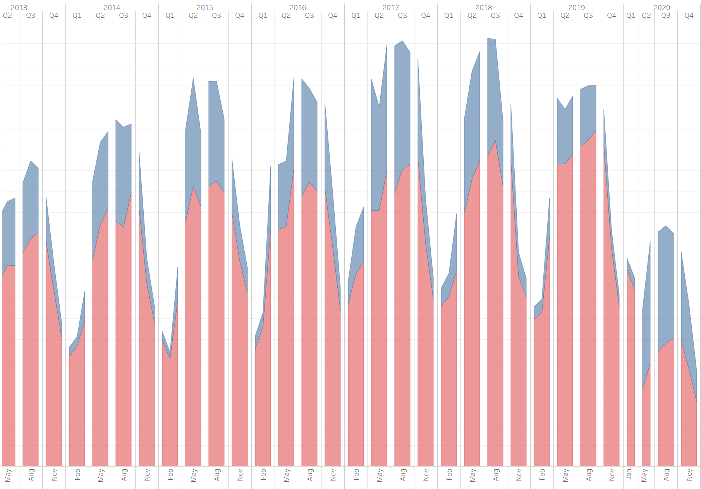
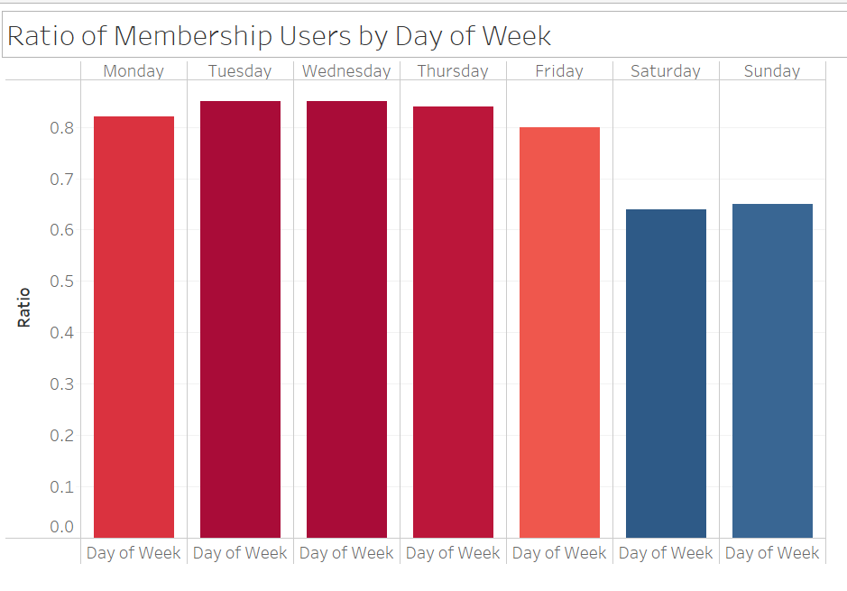

# FINAL PROJECT
## BIKESHARING SERVICES
An Analysis of Public Bike Sharing Services in Washington DC to uncover growing membership trends for potential business expansion

## REASONS FOR SELECTING TOPIC
We want to offer a deeper analysis to investors and the community on the growing membership trends of Public Bike Sharing Services in Washington DC in order to motivate investors to expand the availability of bike stations 

{Mair will insert additional content}

## VARIABLES TO CONSIDER
- Location of Bike Station (Latitude, Longitude, and Zip code)
- User types: Member and Casual
- Bike routes: Popular and Unpopular
- User number: Weekday and Weekend
- Time of day of the ride

## DESCRIPTION OF THE SOURCE DATA
For our analysis, we are using secondary data which has already been collected by the capital bike share website (https://www.capitalbikeshare.com/system-data). The data was stored in CSV format and we were able to find data from 2010 to 2021. 

For the years 2010 and 2011 the daily bike ride information of the whole year was gathered in a unique CSV file. From 2012 to 2017, the daily bike ride information was gathered in quarterly arranged CSV files and from 2018 to 2021 the bike ride information was collected in monthly CSV files. Data for the month of april 2020 was not available and year 2021 cut in the month of may.

In total, our final data was 66 CSV files with over 26,000,000 rows and 8 columns each.

### BikeSharing Data:
- Capital Bikshare (Washington D.C.) from 2010 - 05/2021. Retrieved from: https://s3.amazonaws.com/capitalbikeshare-data/index.html

## QUESTIONS TO ANSWER
Q. How does time of day influences the member type of riders in Washington D.C.?

Q. How does the weekday/weekend difference influence the membership type of riders in Washington D.C.?

Q. How does type of bike affect membership type?

H0: The member type of riders is not related to the time of the day of the ride. 

## ETL Process

### Table1_all_bike_trips
1. Process Capital Bikeshare bike trip data sets to create one big dataset that contains all 28M trips with followings columns: 'Trip Number,' 'Starts station number,' 'End station number,' 'start date,' 'end date,' and 'member type' to enable us review when and where each bike trip took place and whether it was done by a member or a casual user. 
    - Downloaded the total 65 Capital Bikeshare bike trip dataset available from `Index of bucket "capitalbikeshare-data"` page of Capital Bikeshare website.
    - Create an index of the 65 files as a csv file to allow python code able to call files by each file's directory and file name. Then, process files with index 0-52 and 53-65 separately as those files have different columns. The list can be refered to the csv file <Resources/capitalbikeshare_dataset_index.csv>.
   - The files from index 0-52 have unique column 'Bike number' which define which bike was used for each trip.
   - After cleaning the data and dropping unnecessary columns, output the dataframe as csv file `trips_2010to202003.csv`.
   - The files with indexes 53-65 have unique column called 'rideable_type,' which describes which bike type was used. We extract this information separately to analyze how this variable affects the membership type of users.
   - After cleaning the data and dropping unnecessary columns, output the dataframe as csv file `trips_202005to202105.csv`.
   - Merge the `trips_2010to202003.csv` and `trips_202005to202105.csv` files together 
   - Drop unnecessary columns, clean up NaN rows, remove mixed data type columns, convert datatype, and output the dataframe as `Table1_all_bike_trips.csv`.
 
### Table2_bike_number and Table3_rideable_type
2. Create two additional tables from `trips_2010to202003.csv` and `trips_202005to202105.csv` that represent 'Bike number' and 'rideable_type' of bikes respectively.
   - Extract `Table2_bike_number.csv` dataframe and ouput as csv from the `trips_2010to202003.csv`.
   - Extract `Table3_rideable_type` dataframe and ouput as csv from the `trips_202005to202105.csv`.

### Table4_station_list and Table5_station_active_dates
3. Create a dataset with list of `station_id` and corresponding latitude and longitude by utilizing the datasets from April 2020 to May 2021. Note the most recent file available is May 2021 and Capital Bikeshare started to record geographic information since April 2020.
    - Use the files from index 53 to 65 to create a new dataframe with 'stationnumber' and its corresponding geocode.
    - The output csv file `Table4_station_list` has columns `stationnumber`, `lat`, and `lng` to refer the location of each bike station.
  
4. Output an additional list of bike stations that displays the first day and the last day of their usage to identify if any stations have imbalance in number of data points due its length of operation.
    - Use the `Table1_all_bike_trips.csv` and pick the first time and the last time that each `startstationnumber` appears in the list
    - Output the dataframe with `startstationnumber`, `first`, and `last` as a csv file `Table5_station_active_dates.csv`.

### Table6_number_of_trips
5.  From the `all_bike_trips.csv` file, extract an additional dataframe that displays number of trips took by each staion number.
    - Utilize `value_counts()` method and list how many times does each station appear over the 28M trips.
    - Output the dataframe with `startstationnumber` and its `occurence` as a csv file `Table6_number_of_trips.csv`.

### Table7_member_trips and Table8_casual_trips
7.  Create two separate datasets listing trips done by 'Member' users and 'Casual' users separately.
    - Refer to the `Table1_all_bike_trips.csv` and pick the rows with `membertype` being `Member` and `Casual` separately into two dataframes: `Table7_member_trips.csv` and `Table8_casual_trips.csv`.

### Table9_ratio_df and Table10_dayofweek_ratio
8.  Create a table listing the ratio of trips done by 'Member' users over the all trips have done at each station.
    - Refer to the `Table7_member_trips.csv` and `Table8_casual_trips.csv` files for number of trips done at each station by `Member` and `Casual` using `value_counts()`. Then, calculate the ratio based on those values to figure out the ratio of `Member` usage by each station.
    - Output the resulted dataframe as `Table9_ratio_df.csv` file.
    
9.  Create a table listing the ratio of trips done by 'Member' users over the all trips by each day of week.
    - Refer to the `Table7_member_trips.csv` and `Table8_casual_trips.csv` files and figure out the ratio of `Member` users by each day of week.
    - Output the resulted dataframe as `Table10_dayofweek_ratio.csv` file.

Table #1 all_bikes_trips

Table #2 bike_number

Table #3 Rideable_type

Table #4 Station List

Table #5 Station List with its active dates

## Database Integration

Our database has been refined and currently, holds the following schema:

The connection between tables, the fields that have been kept and the data types are displayed in the image above. After cleaned and organized the raw data extracted from the citibike website, we created five tables that are ready for our analysis and load the in to PostgerSQL database. While we are working on our project we have also extracted different tables using SQL join query. Looking at the image below we can see the Table created by Inner join from our *station_list* and *station_list_active*.

## MACHINE LEARNING
In the machine learning part of our project, we try to predict future growth of bikesharing in DC. Using timeseries data and ARIMA model the project performs trend analysis and predict future prospect of the bike sharing.
This project tries to achive two main goals in this time series analysis. First, it identifies the sequence of observations , and second, predict the future values of the the timeseries univeriate variable(**Number of Trips**).

 - **Visualizing time series**
 Looking at below chart we can see the upward trend of *Number of trips* for the last from 2010 till 2018.
 

Regarding timeseries analysis our series needs to be stationary(i.e *Number of trips* shouls have a constant mean, variance and covariance). However, as we can see the above chart the mean is not constant.This implies our series is not stationary.

To get a more clear insight of our timeseries data, we will plot the **level**, **Trend**, **Seasonality**, and **Noise** charts.These charts explains the average value in the sseries, the increasing or decreasing value in the series, the repeating short-term cycle in the series, and the random variation in the series respectively.

Looking at the above charts there is an upward trend and a recurring event where number of bike trips shoots maximum every year.

  - **Stationarising the time series**

ARIMA Model:
Part 1: Preprocessing (Completed)
1) Read in 'all_bike' csv
- Change Trip_number col to lowercase
1) Read in 'bike_type' csv
- Encode bike types
- Rename cols
1) Merge 'all_bike' and 'bike_type'
2) Drop unnecessary cols
3) Change 'startdate' from object to datetime
4) Set index to 'startdate'

Part 2: Split Train_Test

Part 3: Check for Stationarity

Part 4: Modeling/Forecasting

Part 5: Evaluate/Improve Forecasting/Predictions 

## DASHBOARD
Visualization of Trip number change overtime by Member or Casual users
Observations:
1. The majority of trips have been taken by 'Member' users. 
2. The trend of increase in 'Member' user ratio is sustained until 2019
3. In general Q1 and Q4 experience lower bike trips overall

Visualization of Station and Member or Casual Users:

1. We see higher ratio of 'Casual' users at the stations located near Point of interest suchs as Lincoln Memorial, Museums, White House, etc...
2. The 'Member' users are often starting their travel near Union Station, Dupont Circle, Mass Ave, Rhode Island Ave, Pennsylvania Ave, etc...

This visualization shows that the Ratio of Memberhsip user is higher in Weekday:

1. The ratio of trips done by 'Member' users in weekday is 80-85%
2. The ratio of trips done by 'Member' users in weekday is 64-65%

Future visualization ideas:

1. Evaluate how number of trips changes by staion depends on Weekday or Weekend
2. Analyze how time of day may affect the overall trip occurence and the ratio of 'Member' user.
